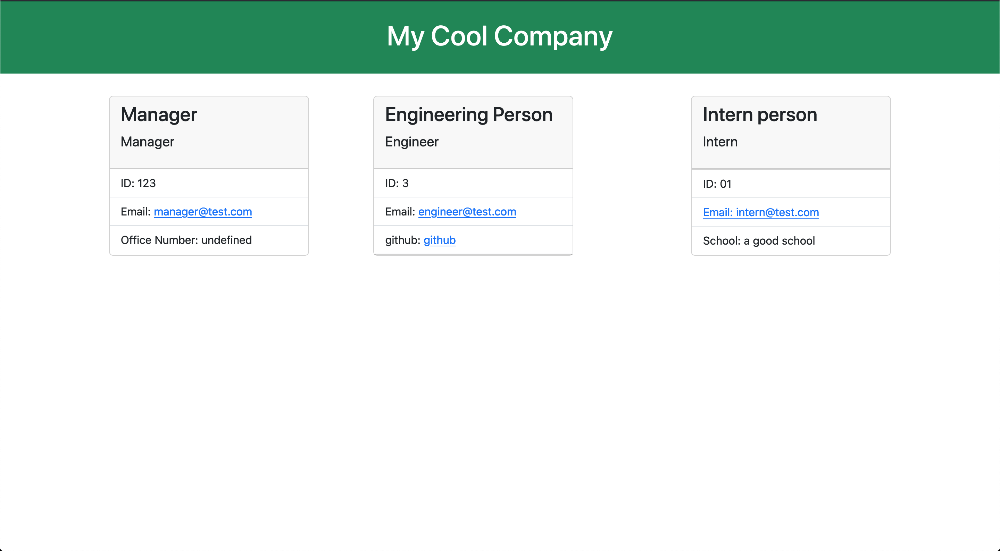

# Team Profile Generator
## Table of Contents
1. [Description](#description)
2. [Installation](#installation)
3. [Usage](#usage)
4. [Video Walkthrough](#video-walkthrough)
## Description
This is an application for companies to generate a team profile page with all of their employees. This is done through the command line using the node package 'inquirer'. After the user inputs the necessary information, a stylized HTML page is generated this information.

## Installation
To install this app, clone this repo to your local machine. Once cloned, navigate to the applications's root directory within your terminal and run:
```
npm install
``` 
to install the necessary dependencies. 

## Usage
To use this app, after you have installed the necessary dependencies, while in the application's root directory run the following command:
```
node index.js
```
This will start up the application within your terminal, now follow given instructions.

Once complete, there should be a generated index.HTML within the 'dist' folder. Open this to see your new team page! Will look something like this:



## Links
Here is a link to a video walkthrough of this applications: [Link](https://drive.google.com/file/d/1QzQ0QT4V9k-KTbPsuz1R5zog4JCm1Qyd/view?usp=share_link)